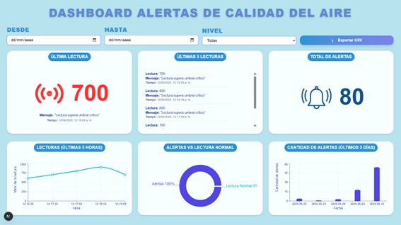

This is a [Next.js](https://nextjs.org) project bootstrapped with [`create-next-app`](https://nextjs.org/docs/app/api-reference/cli/create-next-app).

## Getting Started

First, run the development server:

```bash
npm run dev
# or
yarn dev
# or
pnpm dev
# or
bun dev
```

Open [http://localhost:3000](http://localhost:3000) with your browser to see the result.

You can start editing the page by modifying `app/page.tsx`. The page auto-updates as you edit the file.

This project uses [`next/font`](https://nextjs.org/docs/app/building-your-application/optimizing/fonts) to automatically optimize and load [Geist](https://vercel.com/font), a new font family for Vercel.

## Learn More

To learn more about Next.js, take a look at the following resources:

- [Next.js Documentation](https://nextjs.org/docs) - learn about Next.js features and API.
- [Learn Next.js](https://nextjs.org/learn) - an interactive Next.js tutorial.

You can check out [the Next.js GitHub repository](https://github.com/vercel/next.js) - your feedback and contributions are welcome!

## Deploy on Vercel

The easiest way to deploy your Next.js app is to use the [Vercel Platform](https://vercel.com/new?utm_medium=default-template&filter=next.js&utm_source=create-next-app&utm_campaign=create-next-app-readme) from the creators of Next.js.

Check out our [Next.js deployment documentation](https://nextjs.org/docs/app/building-your-application/deploying) for more details.


# Dashboard version 1


# Dashboard version 2


# Dashboard version 3




# Dashboard version LUCAS ANTES


# Dashboard version MEJORADA 190625


# CODIGO MICROCONTROLADOR

#include <ESP8266WiFi.h>
#include <WiFiClientSecure.h>
#include <ESP8266HTTPClient.h>

// Parámetros de la red WiFi
const char* ssid = "Redmi12C";
const char* password = "12042003";

// URL del API Gateway HTTPS
const char* api_url = "https://66g81vr8rh.execute-api.us-east-1.amazonaws.com/dev/sensor";

void setup() {
  Serial.begin(115200);
  WiFi.begin(ssid, password);
  
  int intentos = 0;
  while (WiFi.status() != WL_CONNECTED && intentos < 20) {
    delay(500);
    Serial.print(".");
    intentos++;
  }

  if (WiFi.status() == WL_CONNECTED) {
    Serial.println("\nConectado al WiFi");
  } else {
    Serial.println("\nNo se pudo conectar al WiFi. Reiniciando...");
    ESP.restart();
  }
}

void loop() {
  if (WiFi.status() == WL_CONNECTED) {
    int lectura = analogRead(A0);

    WiFiClientSecure client;
    client.setInsecure();  // ⚠️ Solo para pruebas

    HTTPClient https;
    String payload = "{\"sensor_id\":\"MQ135-1\",\"lectura\":" + String(lectura) + "}";

    Serial.print("Enviando: ");
    Serial.println(payload);

    if (https.begin(client, api_url)) {
      https.addHeader("Content-Type", "application/json");
      https.addHeader("Accept", "*/*");
      https.addHeader("Connection", "close");
      https.addHeader("User-Agent", "ESP8266");

      int httpCode = https.POST(payload);

      Serial.print("Código de respuesta: ");
      Serial.println(httpCode);
      Serial.print("Respuesta del servidor: ");
      Serial.println(https.getString());

      https.end();
    } else {
      Serial.println("❌ Error iniciando la conexión HTTPS");
    }
  } else {
    Serial.println("WiFi desconectado. Reintentando...");
    WiFi.begin(ssid, password);
  }

  delay(2000);  // Esperar 2 segundos antes del próximo envío
}
